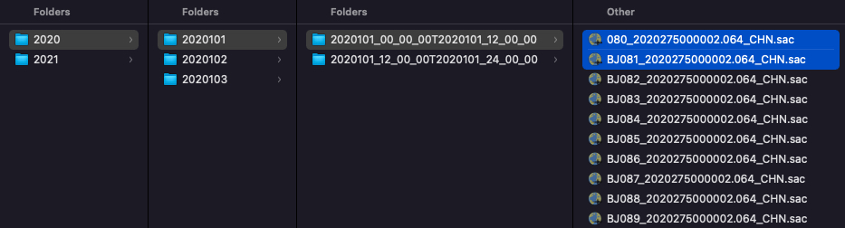
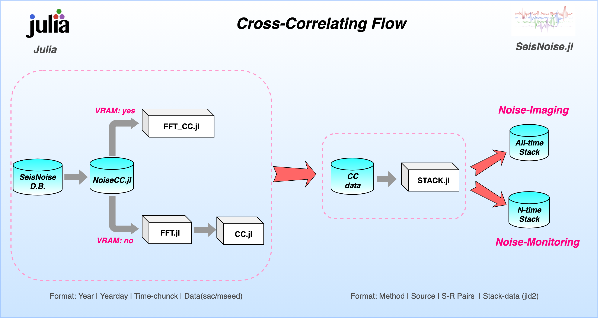
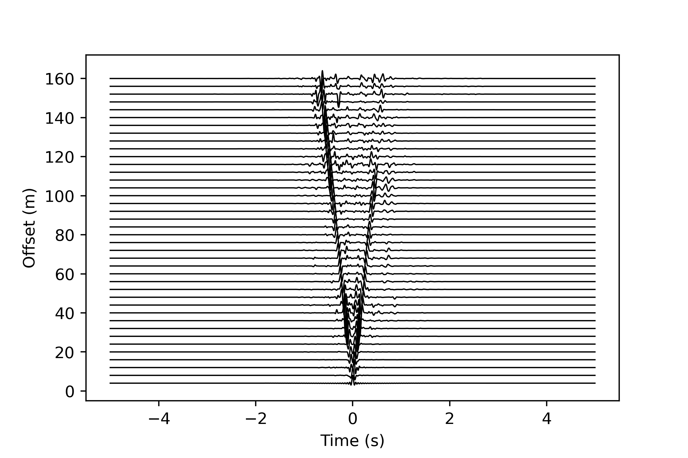

# NoiseCC.jl: A framwork for large ambient noise cross-correlation (CC) based on SeisNoise.jl.

🚨 **The package is still undergoing development.** 🚨

NoiseCC.jl use Multi-process and Multi-thread to accelerate noise cross-correlation (CC) for large dataset. All the core code for CC comes from [SeisNoise.jl](https://github.com/tclements/SeisNoise.jl), and this package is an example of SeisNoise.jl application. We designed a generic CC framework which is suitable for large-scale Dense-Stations, Large-N and DAS data sets. It is convenient for the subsequent study of noise-imaging and noise-monitor.
## Dependencies
The package NoiseCC.jl runs on Unix-like systems including Mac and Linux. Package need Julia 1.6 or greater. It depends on the following Julia modules:

- [SeisIo](https://seisio.readthedocs.io/en/latest/)
- [SeisNoise](https://github.com/tclements/SeisNoise.jl)
- [Distributed](https://docs.julialang.org/en/v1/manual/distributed-computing/)
- [JLD2](https://github.com/JuliaIO/JLD2.jl)

## Installation
Install [SeisNoise](https://github.com/tclements/SeisNoise.jl) firstly. Use the Julia package manager (Press `]` to enter `pkg`):

```julia
julia>]
(@v1.6) pkg> add SeisNoise
```

Then install NoiseCC:

```julia
(@v1.6) pkg> add NoiseCC
```
## Framwork
### Prepare database
Before using NoiseCC.jl, you should prepare the **database**. Make sure the name of the file contains the exact network, station and component information. The following figure shows the format of other paths in the database. 
- **Format: Year | Yearday | Time-Chunck | Data(sac/mseed)**



Notice that the name of file *080_2020275000002.064_CHN.sac* do not include *Network* name, which is not recommended.

### Processing flow


## Usage
NoiseCC.jl includes 2 modes of cross-correlation for seismic data.

- FFT --> CC --> STACK
- FFT_CC --> STACK

### 1-CC:
**[NoiseCC.FFT:](docs/src/FFT.md)** Use Multi-process to accelerate FFT from raw-data (sac/mseed) to fft-data (FFTData). Parameters description [**here**](docs/src/FFT.md).
```julia
NoiseCC.FFT(
    # processes parameters
    cores,flag,precompile,
    # absolute path parameters
    FFTDIR,
    # select sac/mseed files or not
    select_file,
    # when select_file = ture, 'TMPTXT' works
    FILETXT,
    # when select_file = false, 'DATADIR' 'select_sta' 'STATXT' and 'ncomp' work.
    DATADIR,select_sta,STATXT,channel_regular,
    # instrument parameters
    rm_resp,respdir,
    # some control parameters
    input_fmt,time_norm,freq_norm,cc_method,
    # pre-processing parameters
    freqmin,freqmax,cc_len,cc_step,
    # criteria for data selection in time_norm
    factor_clip_std,factor_mute,time_half_win,
    # criteria for data selection in freq_norm
    freq_half_win,
)
```

**[NoiseCC.CC:](docs/src/CC.md)** Use Multi-process and Multi-thread to accelerate cross-correlation from fft-data (FFTData) to corr-data (CORRData). Parameters description [**here**](docs/src/CC.md).
```julia
NoiseCC.CC(
    # processes and threads parameters
    cores,threads,flag,precompile,
    # absolute path parameters
    FFTDIR,CCFDIR,
    # select time-chunck folder for cross-correlate
    select_time,TIMETXT,
    # select station for cross
    select_sta,STATXT,SRTXT,channel_regular,comp,
    # some control parameters
    cc_method,auto_corr,cross_corr,
    # cross-correlation parameters
    maxlag,substack,substack_method,
)
```

**[NoiseCC.FFT_CC:](docs/src/FFT_CC.md)** Use Multi-process and Multi-thread to accelerate FFT and CC from raw-data (sac/mseed) to corr-data (CORRData). Parameters description [**here**](docs/src/FFT_CC.md).
```julia
NoiseCC.FFT_CC(
    # processes and threads parameters
    cores,threads,flag,precompile,
    # absolute path parameters
    DATADIR,CCFDIR,
    # select time-chunck folder for cross-correlate
    select_time,TIMETXT,
    # select station for cross
    select_sta,STATXT,SRTXT,channel_regular,
    # instrument parameters
    rm_resp,respdir,
    # some control parameters
    input_fmt,time_norm,freq_norm,cc_method,auto_corr,cross_corr,
    # pre-processing parameters
    freqmin,freqmax,cc_len,cc_step,
    # cross-correlation parameters
    maxlag,substack,substack_method,
    # criteria for data selection in time_norm
    factor_clip_std,factor_mute,time_half_win,
    # criteria for data selection in freq_norm
    freq_half_win,
)
```

### 2-STACK:

**[NoiseCC.STACK:](docs/src/STACK.md)** Use Multi-process and Multi-thread to accelerate STACK with corr-data (CORRData). Parameters description [**here**](docs/src/STACK.md).
```julia
NoiseCC.STACK(
    # process and threads parameters
    cores,threads,flag,precompile,
    # absolute path parameters
    CCFDIR,STACKDIR,
    # select time-chunck folder for stack
    select_time,TIMETXT,
    # select station for stack
    select_sta,STATXT,SRTXT,channel_regular,comp,
    # stack time interval
    stack_all,time_interval,min_stack_chunck,
    # stack method
    substack_method,stack_method,auto_stack,cross_stack,
    # filter 
    select_filter,freqmin,freqmax,corners,zerophase,
    # criteria for corr-data selection
    select_corr,median_high,median_low,
)
```


### 3-PLOT:
**[S0_read_jld2.py:](src/plot/S0_read_jld2.py)** Use Matplotlib for visualization, HDF5 files can be read by h5py package.

**[S1_plot_waveform.py:](src/plot/S1_plot_waveform.py)** 



**[S2_plot_moveout.py:](src/plot/S2_plot_moveout.py)** working...

**[S3_plot_dailychange.py:](src/plot/S3_plot_dailychange.py)** working...

## References
[1] Clements, T., and M. A. Denolle (2020). SeisNoise.jl: Ambient Seismic Noise Cross Correlation on the CPU and GPU in Julia, Seismol. Res. Lett. 92, 517–527, doi: 10.1785/ 0220200192.

[2] Jones, J. P., K. Okubo, T. Clements, and M. A. Denolle (2020). SeisIO: A Fast, Efficient Geophysical Data Architecture for the Julia Language, Seismol. Res. Lett. 91, 2368–2377, doi: 10.1785/0220190295.
