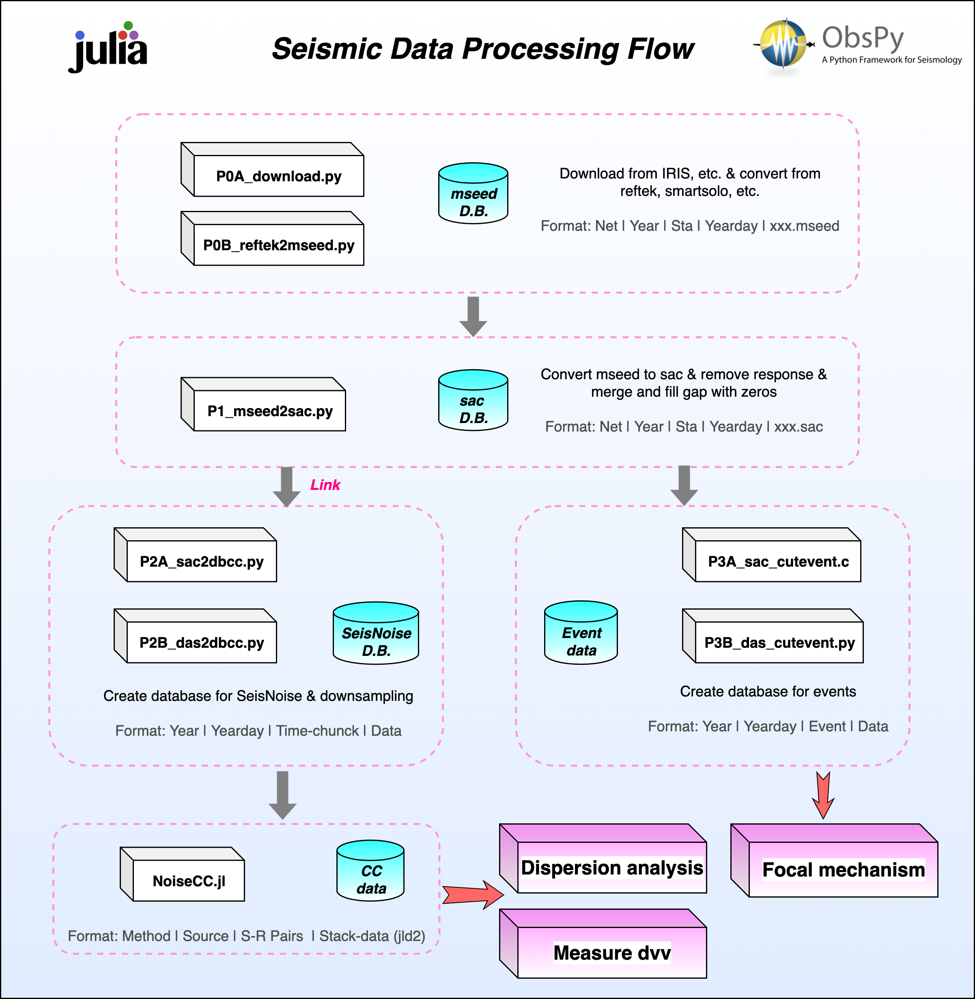
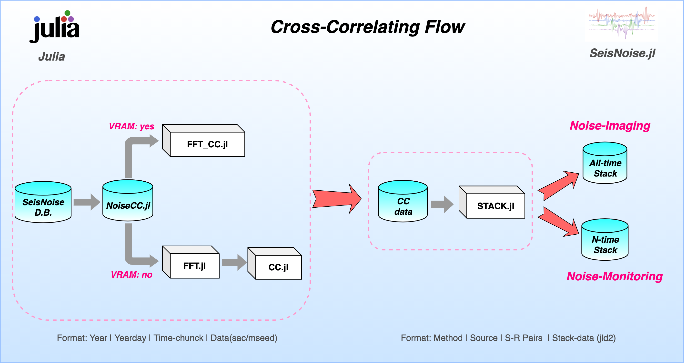

# Prepare database
Before using NoiseCC.jl, you should prepare the **database**. Make sure the name of the file contains the exact network, station and component information. The following figure shows the format of other paths in the database. 

- **Format: Year | Yearday | Time-Chunck | Data(sac/mseed)**

# Processing flow

# CC flow
